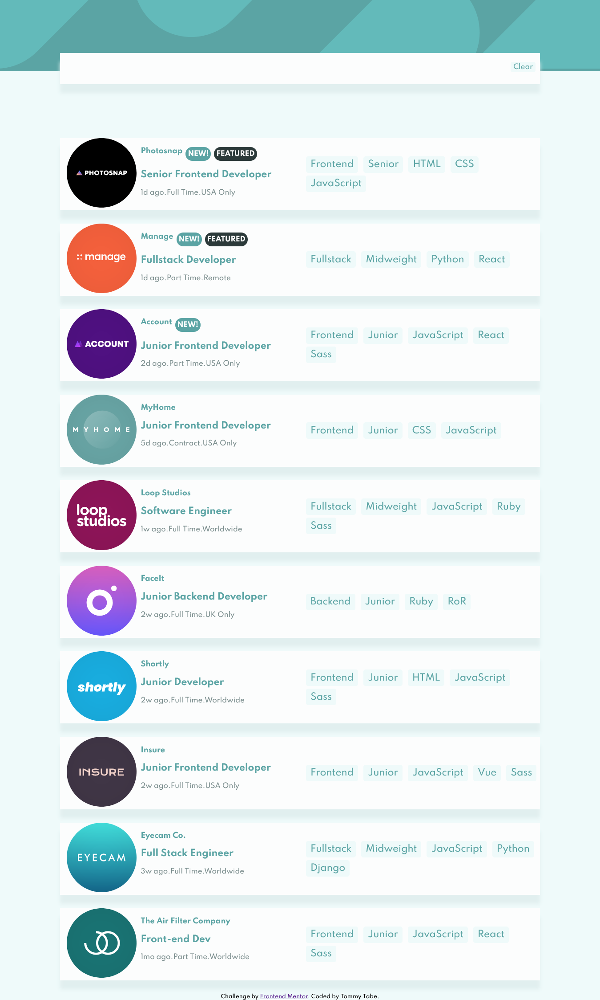

# Frontend Mentor - Job listings with filtering solution

This is a solution to the [Job listings with filtering challenge on Frontend Mentor](https://www.frontendmentor.io/challenges/job-listings-with-filtering-ivstIPCt). Frontend Mentor challenges help you improve your coding skills by building realistic projects. 

## Table of contents

- [Overview](#overview)
  - [The challenge](#the-challenge)
  - [Screenshot](#screenshot)
  - [Links](#links)
- [My process](#my-process)
  - [Built with](#built-with)
- [Author](#author)

## Overview

### The challenge

Users should be able to:

- View the optimal layout for the site depending on their device's screen size
- See hover states for all interactive elements on the page
- Filter job listings based on the categories

### Screenshot

## My Process

### Links

- Live Site URL:(https://tabetommy.github.io/job-listings/)

### Built with

- HTML5 
- CSS 
- Flexbox
- [React](https://reactjs.org/) - JS library.

## Author

- Frontend Mentor - [@Tommy Tabe](https://www.frontendmentor.io/profile/tabetommy)
- Linkedin - [@Tommy Egbe](https://www.linkedin.com/in/tommy-egbe-304464116/)

